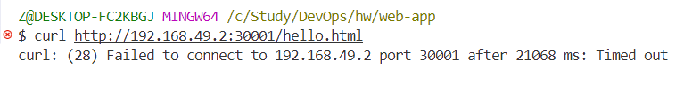

# Запуск Web-приложения в Kubernetes через Docker

## Описание
Этот проект демонстрирует процесс создания web-приложения с использованием Python HTTP-сервера, упаковку приложения в Docker-образ и развёртывание его в Kubernetes-кластере.

## Шаги выполнения

### 1. Создание Dockerfile

Создадим файл `hello.html`, который будет содержать "Hello World":
```html
<!DOCTYPE html>
<html>
<head>
  <title>Hello World</title>
</head>
<body>
  <h1>Hello World</h1>
</body>
</html>
```

Созданим `Dockerfile` для Python HTTP-сервера, который запускается с UID 10001:

```dockerfile
FROM python:3.12-alpine

# Установка рабочего каталога /app
WORKDIR /app

# Копирование файлов в контейнер
COPY hello.html /app/
COPY Dockerfile /app/

# Создание пользователя с UID 10001
RUN adduser -D -u 10001 user
USER user

# Запуск Python HTTP-сервера
CMD ["python", "-m", "http.server", "8000"]
```


### 2. Сборка Docker-образа

Запустим команду для сборки образа:

```bash
docker build -t my-web-app:1.0.0 .
```


Проверим, что образ создан:

```bash
docker images
```


### 3. Запуск контейнера локально

Для проверки работы контейнера:

```bash
docker run -d -p 8000:8000 my-web-app:1.0.0
```


Проверим доступность `hello.html`:

```bash
curl http://localhost:8000/hello.html
```


Откроем браузер и перейдём по адресу http://localhost:8000/hello.html:


Поскольку всё работает, загрузим образ в Docker Hub. Для этого надо залогиниться, задать тег для образа, привязав его к Docker Hub аккаунту и, непосреддственно, загрузить образ:
```bash

docker login

docker tag my-web-app:1.0.0 zinanana/my-web-app:1.0.0

docker push zinanana/my-web-app:1.0.0
```


### 4. Развёртывание в Kubernetes

#### 4.1. Подготовка манифеста Deployment

Создадим файл `deployment.yaml`:

```yaml
apiVersion: apps/v1
kind: Deployment
metadata:
  name: web
spec:
  replicas: 2
  selector:
    matchLabels:
      app: web
  template:
    metadata:
      labels:
        app: web
    spec:
      containers:
      - name: web-container
        image: my-web-app:1.0.0
        ports:
        - containerPort: 8000
        livenessProbe:
          httpGet:
            path: /hello.html
            port: 8000
          initialDelaySeconds: 5
          periodSeconds: 10
```

Применим манифест:

```bash
kubectl apply -f deployment.yaml
```


#### 4.2. Создание Service для доступа извне
Создадим Service с типом `NodePort`:

```yaml
apiVersion: v1
kind: Service
metadata:
  name: web-service
spec:
  selector:
    app: web
  ports:
    - protocol: TCP
      port: 8081
      targetPort: 8000
      nodePort: 30001
  type: NodePort
```

Применим манифест Service:

```bash
kubectl apply -f service.yaml
```


Проверим статус подов:
```bash
kubectl get pods
```


### 5. Проверка работы

#### 5.1. Получение информации о Deployment

```bash
kubectl describe deployment web
```


#### 5.2. Получение информации о Service

```bash
kubectl describe service web-service
```


**NodePort**: 30001

#### 5.3. Проверка доступности приложения
Узнаем IP-адрес ноды:

```bash
kubectl get nodes -o wide
```


**Internal IP**: 192.168.49.2

Проверим доступность приложения через NodePort:

```bash
curl http://192.168.49.2:30001/hello.html
```



Получаем сообщение о том, что подкрючиться по адресу не удалось.

Почему так происходит?
1. Minikube с Docker-драйвером:
    - Когда Minikube запускается с драйвером Docker (по умолчанию на Windows), кластер находится в виртуальной сети Docker.
    - Внешний доступ возможен только через localhost, а Internal IP узла (192.168.49.2) остаётся изолированным внутри виртуальной сети.
2. Minikube перенаправляет порты из Docker-сети в локальную сеть. Поэтому, вместо использования 192.168.49.2, мы должны обращаться к 127.0.0.1.

Для получения прямой ссылки к нашему сервису выполним:

```bash
minikube service web-service --url
```


Снова выполним `curl`, но с прямой ссылкой:

```bash
curl http://127.0.0.1:60808/hello.html
```


Откроем браузер и перейдём по адресу http://127.0.0.1:60808/hello.html:


